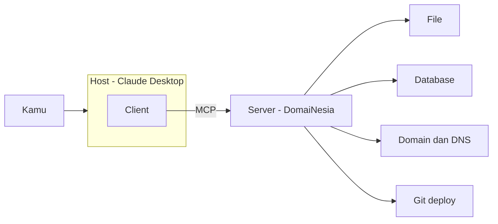

# Otomasi AI Agent

Kelola Website dan Hosting pakai MCP


<div class="absolute bottom-10">
  <div class="font-semibold">Ivan Kristianto</div>
  <div class="text-sm opacity-70">Google Developer Expert for Web Technology</div>
  <div class="text-sm opacity-50 mt-3">Kelas Tanya DomaiNesia · 24 September 2026</div>
</div>

<!--
Total 38 menit materi, 15 menit tanya jawab.
Sapa dulu, tanya di chat: siapa yang punya website sendiri? Siapa yang pernah buka cPanel?
Jawaban itu dipakai untuk kalibrasi kedalaman penjelasan.
-->

---
layout: center
class: text-center
---

# Malam ini kita jawab satu pertanyaan

<div class="text-2xl mt-8 opacity-90">

Bisakah AI <AutoMark>benar-benar mengerjakan</AutoMark> urusan website saya,

bukan cuma memberi saran?

</div>

<div v-click class="mt-12 opacity-60 text-base">
Tanpa menulis satu baris kode.
</div>

<!--
Tekankan "mengerjakan". Selama ini AI cuma kasih tahu caranya, kita yang eksekusi.
[click] Dan ini bagian yang bikin ini relevan buat yang bukan programmer.
-->

---
layout: section
---

# 1. AI Agent

Apa bedanya dengan chatbot biasa

---
layout: two-cols-header
---

# Chatbot vs Agent

::left::

<div class="pr-6">

### Chatbot

- Kamu tanya, dia menjawab
- Semua eksekusi tetap di tangan kamu
- "Coba cek error log di cPanel, biasanya ada di folder logs"

</div>

::right::

<div v-click class="pl-2">

### Agent

- Kamu kasih tujuan, dia mengerjakan
- Dia yang membuka, membaca, memutuskan
- "Sudah saya baca log-nya. Ada 47 error yang sama, penyebabnya plugin X."

</div>

<!--
Pause di kalimat terakhir. Bedanya bukan kepintaran, tapi akses dan izin bertindak.
-->

---
layout: default
clicks: 5
---

# Cara kerja agent

<div class="mt-2">
  <AgentLoop :active="$clicks" />
</div>

<!--
Klik satu-satu sambil cerita satu kasus: "website saya error 500".
1 Terima tujuan, 2 Pilih tool (baca file log), 3 Jalankan, 4 Baca hasil, lalu ulangi.
Poin penting: agent memutuskan sendiri langkah berikutnya berdasarkan hasil.
-->

---
layout: default
---

# Sebenarnya kamu sudah pakai

<div class="grid grid-cols-3 gap-6 mt-10">

<div class="text-center">
  <carbon-search class="text-4xl opacity-70 mx-auto" />
  <div class="mt-3 font-semibold">Cari di web</div>
  <div class="text-sm opacity-60 mt-1">AI berhenti menjawab, browsing dulu, baru lanjut</div>
</div>

<div class="text-center">
  <carbon-document class="text-4xl opacity-70 mx-auto" />
  <div class="mt-3 font-semibold">Baca PDF</div>
  <div class="text-sm opacity-60 mt-1">Kamu lampirkan file, dia buka dan ringkas</div>
</div>

<div class="text-center">
  <carbon-terminal class="text-4xl opacity-70 mx-auto" />
  <div class="mt-3 font-semibold">Ubah kode</div>
  <div class="text-sm opacity-60 mt-1">Asisten coding yang menulis langsung ke file</div>
</div>

</div>

<div v-click class="mt-14 text-center text-lg">
Polanya sama: <span v-mark.circle.orange.delay600="1">AI dikasih alat</span>, bukan cuma diajak ngobrol.
</div>

<!--
Ini untuk menurunkan rasa asing. Mereka sudah pernah lihat agent, cuma belum menyebutnya begitu.
-->

---
layout: statement
class: text-center
---

# Tapi ada satu hal yang belum bisa dia lihat

<div v-click class="text-3xl mt-8 opacity-90">
Hosting kamu.
</div>

<div v-after class="text-base mt-10 opacity-60 max-w-2xl mx-auto">
Tanpa alat, agent cuma tahu data latihannya dan apa yang kamu tempel di chat.
Log error, isi folder, konfigurasi DNS, semua masih harus kamu buka sendiri.
</div>

<!--
Ini jembatan ke MCP. Jangan buru-buru, biarkan pertanyaannya menggantung sebentar.
-->

---
layout: section
---

# 2. MCP

Cara menyambungkan agent ke dunia luar

---
layout: default
---

# Model Context Protocol

<div class="text-xl mt-6 leading-relaxed">
Protokol terbuka yang <AutoMark color="blue">menstandarkan</AutoMark> cara aplikasi AI terhubung
dengan data, tool, dan layanan eksternal.
</div>

<div v-click class="mt-12">

<div class="text-lg opacity-80">Yang sering disalahpahami, MCP itu bukan:</div>

<div class="grid grid-cols-3 gap-4 mt-5">
  <div class="opacity-70 border-l-2 border-red-500/60 dark:border-red-400/40 pl-3 py-1">model AI</div>
  <div class="opacity-70 border-l-2 border-red-500/60 dark:border-red-400/40 pl-3 py-1">tempat melatih model</div>
  <div class="opacity-70 border-l-2 border-red-500/60 dark:border-red-400/40 pl-3 py-1">sistem deployment</div>
</div>

</div>

<div v-after class="mt-10 text-lg opacity-80">
MCP cuma mengurus satu hal: <strong>colokannya</strong>.
</div>

<div v-click class="mt-4 text-sm opacity-60 border-t border-gray-400/20 pt-4 max-w-3xl">
Dan MCP tidak mengganti API. Umumnya MCP server dibangun <strong>di atas</strong> API yang sudah ada,
jadi yang lama tetap jalan.
</div>

<!--
Definisi ini sengaja sama persis dengan artikel DomaiNesia, biar peserta yang baca blog mereka tidak bingung.
Klik terakhir buat peserta developer, sekali sebut saja, jangan berhenti lama.
-->

---
layout: default
clicks: 1
---

# Kenapa ini penting

<div class="mt-4">
  <IntegrationMesh :mode="$clicks >= 1 ? 'mcp' : 'mesh'" />
</div>

<div class="text-center mt-2 h-8">
  <span v-if="$clicks < 1" class="opacity-70">
    3 AI × 4 layanan = <strong>12 integrasi</strong>, masing-masing dibuat khusus
  </span>
  <span v-else class="opacity-90">
    3 + 4 = <strong>7 koneksi</strong> lewat 1 protokol yang sama
  </span>
</div>

<!--
Tunjukkan kekacauannya dulu. Ini dunia sebelum MCP, dan ini alasan integrasi selalu mahal.
[click] Lalu rapikan. Setiap layanan cukup bikin satu MCP server, setiap AI cukup bisa bicara MCP.
Angkanya bukan sihir, tapi bedanya perkalian versus penjumlahan.
-->

---
layout: default
---

# Tiga bagian



<div class="grid grid-cols-3 gap-5 mt-6 text-sm">
  <div><strong>Host</strong><br><span class="opacity-65">aplikasi yang kamu pakai</span></div>
  <div><strong>Client</strong><br><span class="opacity-65">koneksi yang dibuka host</span></div>
  <div><strong>Server</strong><br><span class="opacity-65">pihak yang menyediakan tool</span></div>
</div>

<!--
Jangan lama-lama di sini. Yang perlu nempel cuma: server-nya milik DomaiNesia, bukan milik AI-nya.
-->

---
layout: default
---

# Ini yang menghapus kebutuhan ngoding

<div class="mt-6 opacity-85">
Waktu tersambung, agent bertanya duluan ke server: <em>kamu bisa apa saja?</em>
</div>

<Prompt label="yang terjadi di balik layar" tone="read">
tools/list → get_account_info, list_domains, list_subdomains, ...
</Prompt>

<div v-click>

<div class="mt-6 opacity-85">
Server menjawab dengan daftar kemampuannya, lengkap dengan deskripsi.
</div>

<div class="mt-3 opacity-85">
Kamu tidak pernah menulis kode penyambungnya. Itu sudah jadi bagian dari protokolnya.
</div>

</div>

<div v-after class="mt-8 text-sm opacity-60 border-t border-gray-400/20 pt-4">
Nanti di demo kita minta daftar ini langsung ke server, dan kita lihat isinya bareng-bareng.
</div>

<!--
Ini konsep yang paling sering hilang kalau MCP dijelaskan buru-buru. "Discovery" itu alasan kenapa no-code.
-->

---
layout: section
---

# 3. MCP di DomaiNesia

Dari konsep ke satu kartu di panel

---
layout: default
---

# Letaknya di mana

<div class="mt-8 space-y-5">

<div class="flex gap-4 items-baseline">
  <span class="opacity-40 font-mono text-sm w-6">01</span>
  <span><strong>MyDomaiNesia</strong> → <strong>My Services</strong> → pilih layanan hosting kamu</span>
</div>

<div class="flex gap-4 items-baseline">
  <span class="opacity-40 font-mono text-sm w-6">02</span>
  <span>Di kartu <strong>AI Agent Access (MCP)</strong>, klik <strong>Enable AI Access</strong>, baca risikonya, centang persetujuan</span>
</div>

<div class="flex gap-4 items-baseline">
  <span class="opacity-40 font-mono text-sm w-6">03</span>
  <span>Pilih level akses, lalu buat <strong>MCP Password</strong></span>
</div>

</div>

<div v-click class="mt-10 text-sm opacity-65 flex items-center gap-2">
  <carbon-warning class="text-amber-600 dark:text-amber-500" />
  MCP Password cuma ditampilkan sekali. Simpan seperti kamu menyimpan password utama hosting.
</div>

<!--
Tiga langkah, bukan lima halaman dokumentasi. Ini yang bikin fiturnya terasa mungkin dipakai.
Jangan detail, nanti dilihat langsung waktu demo.
-->

---
layout: default
---

# Empat level akses

<div class="grid grid-cols-2 gap-4 mt-8">

<div>
  <AccessLevel tone="danger" name="Full access" desc="Baca dan ubah hampir semua isi akun. Pakai kalau kamu benar-benar tahu apa yang kamu lakukan." />
</div>

<div>
  <AccessLevel tone="warn" name="No destructive" desc="Boleh mengubah, tapi hapus, uninstall, dan revoke diblokir." />
</div>

<div>
  <AccessLevel tone="safe" name="Read-only" desc="Cuma boleh melihat. Tidak bisa membuat, mengubah, atau menghapus." />
</div>

<div>
  <AccessLevel tone="lock" name="Containment" desc="Paling ketat. Untuk agent yang belum kamu percaya." />
</div>

</div>

<div v-click class="mt-9 text-center text-lg">
Saran saya: mulai dari <span v-mark.circle.green.delay600="1">Read-only</span>, naikkan hanya saat ada alasannya.
</div>

<!--
Ini slide paling praktis di sesi teori. Sebutkan bahwa level bisa diubah kapan saja, jadi tidak ada alasan mulai dari Full.
-->

---
layout: default
---

# Yang bisa dijangkau

<div class="grid grid-cols-2 gap-x-10 gap-y-5 mt-10 text-lg">
  <div class="flex items-center gap-3"><carbon-document class="opacity-60" /> File dan folder</div>
  <div class="flex items-center gap-3"><carbon-data-base class="opacity-60" /> Database</div>
  <div class="flex items-center gap-3"><carbon-cloud class="opacity-60" /> Domain dan DNS</div>
  <div class="flex items-center gap-3"><carbon-branch class="opacity-60" /> Git deploy</div>
</div>

<div class="mt-12 text-sm opacity-60">
Plus sumber daya hosting lain yang tersedia lewat akses ini.
Daftar persisnya kita tanyakan langsung ke server-nya nanti waktu demo.
</div>

<!--
Jujur di sini: dokumentasi publik menyebut empat kategori ini. Kalau ada yang tanya soal email atau backup,
jawab bahwa kita akan lihat daftar tool-nya langsung di demo.
-->

---
layout: section
---

# 4. Keamanan

Bagian yang paling sering dilewati

---
layout: default
---

# MCP Safety Checklist

<div class="mt-8 space-y-5">

<div v-click class="flex gap-4">
  <carbon-view class="text-2xl mt-1 opacity-70 shrink-0" />
  <div>
    <div class="font-semibold">Mulai dari read-only</div>
    <div class="text-sm opacity-60">Sebagian besar kebutuhan sehari-hari cuma butuh membaca.</div>
  </div>
</div>

<div v-click class="flex gap-4">
  <carbon-time class="text-2xl mt-1 opacity-70 shrink-0" />
  <div>
    <div class="font-semibold">Backup sebelum ada yang diubah</div>
    <div class="text-sm opacity-60">Agent yang salah, salahnya cepat.</div>
  </div>
</div>

<div v-click class="flex gap-4">
  <carbon-locked class="text-2xl mt-1 opacity-70 shrink-0" />
  <div>
    <div class="font-semibold">Sebutkan target dengan jelas</div>
    <div class="text-sm opacity-60">Domain ini, folder ini, file ini. Perintah kabur mengundang tafsir luas.</div>
  </div>
</div>

<div v-click class="flex gap-4">
  <carbon-checkmark class="text-2xl mt-1 opacity-70 shrink-0" />
  <div>
    <div class="font-semibold">Baca rencananya sebelum menyetujui</div>
    <div class="text-sm opacity-60">Lalu cek log setelahnya. Apa yang benar-benar dia lakukan.</div>
  </div>
</div>

</div>

<!--
Empat ini yang masuk starter kit. Versi lengkapnya 11 poin, tapi jangan dibacakan semua di sini.
-->

---
layout: default
---

# Perintah yang buruk vs yang aman

````md magic-move
```text
Tolong perbaiki website saya
```

```text
Tolong perbaiki error di website saya
```

```text
Baca error log untuk domain toko-saya.com.
Ringkas 10 error terakhir dan jelaskan penyebabnya.
Jangan ubah file apa pun.
```
````

<div v-click="2" class="mt-8 text-sm opacity-70">
Bedanya ada tiga: <strong>target yang jelas</strong>, <strong>tugas yang sempit</strong>,
dan <strong>batas yang eksplisit</strong>.
</div>

<!--
Klik pelan-pelan. Yang pertama bikin agent menebak. Yang ketiga bikin dia tidak punya ruang untuk menebak.
-->

---
layout: default
---

# Yang jarang dibahas orang

<div class="text-xl mt-6 leading-relaxed">
Konten di server kamu sendiri <AutoMark color="red">bisa berisi perintah</AutoMark>.
</div>

<div v-click>

<div class="mt-6 opacity-85">
Komentar di blog. Satu baris di log. Nama file. File yang diupload orang lain.
</div>

<div class="mt-4 opacity-85">
Waktu agent membacanya, teks itu masuk ke tempat yang sama dengan perintah kamu.
Dan teks itu bisa ikut menyetir.
</div>

</div>

<div v-click class="mt-10 p-4 rounded border border-gray-400/25 bg-gray-400/10">
  <div class="text-sm opacity-60 mb-2">Karena itu pemeriksaan dan perbaikan dipisah:</div>
  <div class="flex items-center gap-3 text-sm">
    <span class="px-2 py-1 rounded bg-gray-400/15">1. Periksa dengan read-only</span>
    <carbon-arrow-right class="opacity-40" />
    <span class="px-2 py-1 rounded bg-gray-400/15">2. Kamu baca hasilnya</span>
    <carbon-arrow-right class="opacity-40" />
    <span class="px-2 py-1 rounded bg-gray-400/15">3. Baru naikkan level dan ubah</span>
  </div>
</div>

<!--
Ini bagian yang paling belum pernah mereka dengar. Pelan-pelan, dan sambungkan ke demo judol nanti:
di demo, agent membaca kode yang ditanam penyerang. Itu contoh nyatanya.
-->

---
layout: section
---

# 5. Demo

<div class="opacity-60 text-base mt-2">Claude Desktop + hosting DomaiNesia</div>

---
layout: default
---

# Rencana demo

<div class="space-y-3 mt-8">

<div class="flex gap-4 items-baseline"><span class="opacity-40 font-mono text-sm w-6">01</span><span>Aktifkan MCP di MyDomaiNesia</span></div>
<div class="flex gap-4 items-baseline"><span class="opacity-40 font-mono text-sm w-6">02</span><span>Pasang extension di Claude Desktop</span></div>
<div class="flex gap-4 items-baseline"><span class="opacity-40 font-mono text-sm w-6">03</span><span>Cek koneksi, lalu tanya daftar tool-nya</span></div>
<div class="flex gap-4 items-baseline"><span class="opacity-40 font-mono text-sm w-6">04</span><span>Baca error log, minta rencana perbaikan</span></div>
<div class="flex gap-4 items-baseline"><span class="opacity-40 font-mono text-sm w-6">05</span><span>Email masuk spam, periksa DNS-nya</span></div>
<div class="flex gap-4 items-baseline"><span class="opacity-40 font-mono text-sm w-6">06</span><span>Cari script judol yang ditanam di website</span></div>

</div>

<div class="mt-10 text-sm opacity-55">
Semua pakai akun hosting percobaan, bukan website klien.
</div>

<!--
Sebut durasinya: sekitar 14 menit. Kalau ada yang gagal, saya lanjut dan jelaskan kenapa, itu juga pelajaran.
-->

---
layout: default
---

# Prompt demo, yang cuma memeriksa

<Prompt label="cek koneksi · read-only" tone="read">
Gunakan MCP DomaiNesia. Periksa apakah koneksi sudah aktif.
Jangan ubah atau hapus file apa pun.
Tampilkan daftar domain/subdomain dan document root yang tersedia.
</Prompt>

<Prompt label="lihat kemampuan server · read-only" tone="read">
Tampilkan daftar lengkap tool yang tersedia beserta deskripsi singkatnya.
Jangan jalankan apa pun.
</Prompt>

<Prompt label="baca error log · read-only" tone="read">
Baca error log untuk domain [domain].
Ringkas 10 error terakhir, kelompokkan yang berulang,
dan jelaskan kemungkinan penyebabnya. Jangan ubah file apa pun.
</Prompt>

<!--
Slide cadangan kalau demo live bermasalah. Kalau demo lancar, lewati saja.
Kalau dipakai: tunjuk kalimat larangan di tiap prompt. Itu bukan basa-basi, itu rem.
-->

---
layout: default
---

# Prompt demo, sisanya

<Prompt label="minta rencana perbaikan · butuh izin menulis" tone="write">
Berdasarkan error tadi, jelaskan perbaikan yang kamu usulkan untuk file [path].
Tunjukkan rencananya dulu, jangan langsung diterapkan.
</Prompt>

<Prompt label="email masuk spam · read-only" tone="read">
Email dari [domain] sering masuk spam.
Periksa DNS record MX, SPF, DKIM, dan DMARC.
Jelaskan mana yang kurang atau salah dan apa dampaknya. Jangan ubah apa pun.
</Prompt>

<Prompt label="cari script judol · read-only" tone="read">
Periksa file di document root [domain] untuk kode yang mencurigakan:
iframe tersembunyi, script ke domain luar, kode terenkripsi base64, atau link judi.
Laporkan file dan barisnya. Jangan hapus apa pun.
</Prompt>

<!--
Prompt pertama itu satu-satunya yang menulis. Ucapkan keras-keras: saya backup dulu,
dan saya cuma naikkan level akses untuk satu langkah ini.
Setelah hasil judol muncul, kembali ke slide prompt injection. Agent barusan membaca
konten yang ditulis penyerang.
-->

---
layout: default
---

# AI Agent Starter Kit

<div class="mt-6 opacity-85">
Kumpulan prompt siap pakai, dikelompokkan per situasi, bukan per fitur.
</div>

<div class="grid grid-cols-2 gap-x-8 gap-y-3 mt-8 text-sm">
  <div class="flex gap-3"><carbon-view class="opacity-50 mt-0.5 shrink-0" /> Website error, baca log-nya</div>
  <div class="flex gap-3"><carbon-email class="opacity-50 mt-0.5 shrink-0" /> Email masuk spam, cek DNS</div>
  <div class="flex gap-3"><carbon-warning class="opacity-50 mt-0.5 shrink-0" /> Scan script judol</div>
  <div class="flex gap-3"><carbon-time class="opacity-50 mt-0.5 shrink-0" /> File apa yang berubah minggu ini</div>
  <div class="flex gap-3"><carbon-data-base class="opacity-50 mt-0.5 shrink-0" /> Ganti nomor telepon di seluruh website</div>
  <div class="flex gap-3"><carbon-cloud class="opacity-50 mt-0.5 shrink-0" /> Pindah layanan tanpa mematikan email</div>
</div>

<div class="mt-10 text-sm opacity-60">
Plus checklist keamanan versi lengkapnya. Tinggal ganti bagian dalam kurung siku dengan domain kamu.
</div>

<!--
Sebutkan cara dapatnya sesuai kesepakatan dengan DomaiNesia. Bacakan satu prompt keras-keras supaya mereka
dengar bentuk prompt yang baik.
-->

---
layout: default
---

# Yang perlu dibawa pulang

<div class="mt-10 space-y-8">

<div v-click class="flex gap-5 items-start">
  <div class="text-3xl opacity-30 dark:opacity-25 font-bold leading-none">1</div>
  <div>
    <div class="text-xl">Agent butuh alat, bukan cuma kepintaran</div>
    <div class="text-sm opacity-60 mt-1">Tanpa akses, dia cuma bisa menyarankan.</div>
  </div>
</div>

<div v-click class="flex gap-5 items-start">
  <div class="text-3xl opacity-30 dark:opacity-25 font-bold leading-none">2</div>
  <div>
    <div class="text-xl">MCP itu colokan standar</div>
    <div class="text-sm opacity-60 mt-1">Satu protokol, dipakai ulang oleh banyak AI dan banyak layanan.</div>
  </div>
</div>

<div v-click class="flex gap-5 items-start">
  <div class="text-3xl opacity-30 dark:opacity-25 font-bold leading-none">3</div>
  <div>
    <div class="text-xl">Mulai dari read-only</div>
    <div class="text-sm opacity-60 mt-1">Level akses itu sabuk pengaman. Kebiasaan kamu yang menyetir.</div>
  </div>
</div>

</div>

<!--
Tiga kalimat ini yang harus bertahan sampai besok pagi. Ucapkan pelan.
-->

---
layout: statement
---

# Tanya Jawab

<div class="mt-8 opacity-60 text-center">
Silakan tulis di kolom chat
</div>

<div class="mt-20 text-sm opacity-40 text-center">
Terima kasih · Ivan Kristianto · Kelas Tanya DomaiNesia
</div>

<!--
Pertanyaan yang hampir pasti muncul:
- Ini berbayar tidak? Fitur MCP-nya bagian dari hosting. Claude Desktop ada versi gratis, tapi pemakaian berat lebih nyaman di paket berbayar.
- AI bisa menghapus website saya? Bisa, kalau kamu kasih Full access. Itu gunanya empat level tadi.
- Kalau saya tidak pakai Claude? DomaiNesia punya panduan untuk ChatGPT, Codex, OpenCode, dan lainnya.
- Data saya dikirim ke mana? Ke penyedia AI yang kamu pakai. Jangan pakai akses ini untuk data yang tidak boleh keluar.
-->
